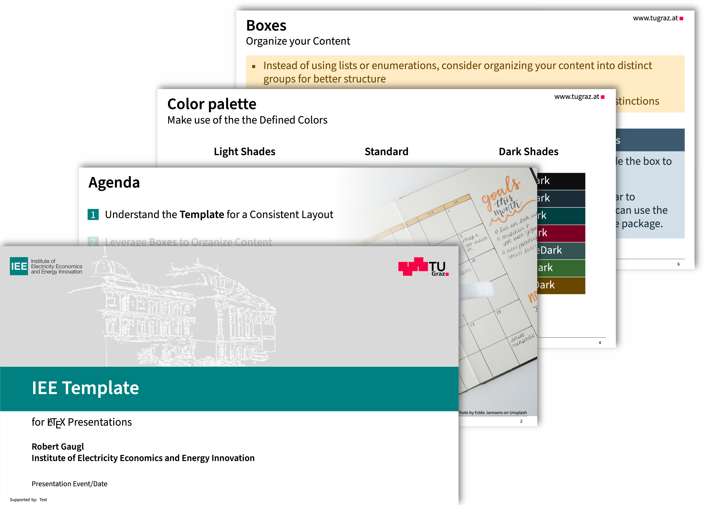

# IEE LaTeX Presentation Template

This repository contains a **LaTeX Beamer presentation template** developed by the Institute of Electricity Economics and Energy Innovation (IEE) at Graz University of Technology. It provides a consistent and professional design style for presentations related to the institute's courses, lectures, and research activities.

   
  <b>Figure 1.</b> Some example slides.

## How to use?
1) Download the ZIP file by clicking the green "**Code**" button and selecting "**Download ZIP**".
2) Depending on your LaTeX editor:
   - **Overleaf**: Click **New Project** > **Upload Project**, then select the downloaded ZIP file.
   - **Other LaTeX editors**: Extract the ZIP file and open the files in your preferred editor.
3) Read the content of the template carefully. It explains the rules for designing a presentation at the IEE and provides helpful tips and tricks.

## Overview

The template includes:

- A custom Beamer theme tailored to IEE's branding and style guidelines.
- Design guidelines to ensure consistent use of colors, fonts, and layout.
- Example slides demonstrating key content structures such as definitions, tasks, goals, and use cases.

## Features

- Use the `\begin{coloredblock}` environment to easily create visually distinct boxes—with or without a title.
- Add subtle background effects with `\insertfadedpicture` to enhance visual appeal.
- Conveniently place source references in the bottom left corner using the `\addsource` command.
- Create consistent title and closing slides with `\maketitleslide` and `\closingslide`. These commands automatically adapt to the selected language.

## Release Notes
- **2025-05-26:**
   - Customizable agenda background picture and source text
- **2025-05-25:**
   - Introduce `\begin{coloredblockicon}` (which replaces `\begin{coloredblockleft}` and `\begin{coloredblockright}`)
   - Include numbering in figures and table captions.
- **2025-05-23:**
   - Complete behind-the-scenes rework of coloredblock logic. (Because of rework, support for`\begin{coloredblockleft}` and `\begin{coloredblockright}` temporarily deactivated.)
   - Blocks now have a border to match IEE style. 
- **2025-05-22:**
   - Support for title in `\begin{coloredblockleft}` and `\begin{coloredblockright}`
   - Add new box style with icon on the right `\begin{coloredblockright}`
   - Move tables to separate files, so that they can compiled on its own
   - Title height is now calculated automatically to ensure proper layout for two-line titles
   - Figures are now compiled separately and included as PDFs to improve main document compilation time
- **2025-05-19:**
   - Add new box style with icon on the left `\begin{coloredblockleft}`
   - Fixed calculation of box height 
   - Change function coloredblocks and add option to customize padding.
   - Optionally display Beamer navigation buttons in the lower left corner (can be enabled in the Options section).
   - Include new list styles (romanenumerate, tugromanenumerate (tighter spacing), boxromanenumerate)
   - Include a section on Overlays to explain how to reveal content step-by-step.
   - Update attribution text for picture used in agenda slide to inlcude links.
   - Set UrlFont to use normal font instead of monospaced font.
- **2025-05-18:**
   - Fix showing `\begin{coloredblock}{turquoise}` on slide Dark Boxes with Title instead of `\begin{coloredblockdark}{turquoise}`.
   - Add highlight to table.
   - Add description that caption text of `\insertfadedpicture` is optional.
   - Deactivate "Sponsored by" on title page.
   - Add function `\addsource` to easily add a source text to the bottom right corner of the slide.
   - Add attribution for fontawesome icons.
- **2025-05-18:**
   - First upload